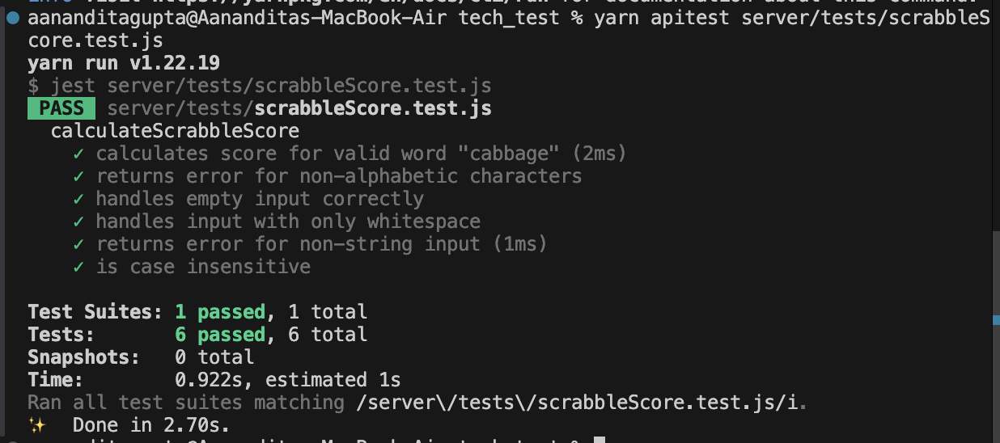
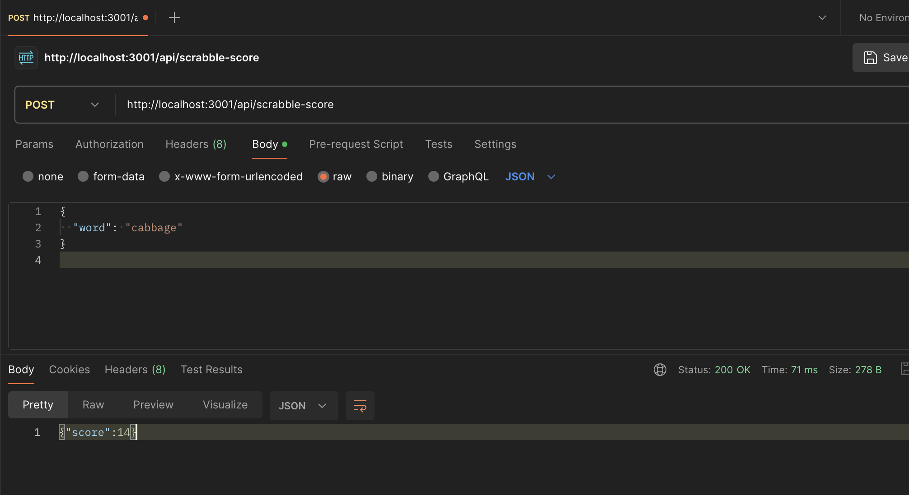

## Introduction

This is a simple React + Node.js application to calculate and show the scrabble score to the user. This app has a customised node.js server that gets the user inputted using apis and sends the score back to the front end, which then shows it to the user.

To give more context into the development process of the UI, I have added screenshots to `/screenshots` folder. There is also a `CHANGELOG.md` file to show the different types of commits done.

## Features Implemented

### Scrabble Score Calculation API:

The project includes a Scrabble Score Calculator API and a React frontend that allows users to interactively calculate Scrabble scores for their input words. The Scrabble Score Calculation API is built using Node.js and Express, providing a `/api/scrabble-score` endpoint that takes a word as input, validates it, and returns its Scrabble score based on standard Scrabble rules. The API is case-insensitive and ensures the input is a valid, non-empty alphabetic string, returning informative error messages for invalid submissions.

### React Frontend Integration:

Integrated the API with a user-friendly interface where users can enter a word and see its corresponding Scrabble score displayed in a table. The input form dynamically handles input changes and validates user input before submission. If the user submits invalid input, such as numbers or special characters, the app displays a clear error message without submitting the form. The results are displayed in a well-structured table that updates with each new submission, providing a clean and interactive user experience.

## Imporovements

- `Sorting and Filtering`: I would liked to include options to sort the table by highest score or lowest score or by length of word or showcase all the information in the same table with multiple columns

- `Animations`: Given more time, I also would like to add some animation to the way the new word gets added to the table below. Something to hightlight the new words added to the table

- `Dictionary API`: Extend the functionality to add a check using a Dictionary API. This would make it more realistic and could help the user learn new words as well

- `Total Score`: A simple feature but add a total score on top to see what the users total score is

# Using this project

Clone the project, change into the directory and install the dependencies.

Please use
node version

```
16.0.0
```

yarn version

```
1.22.19
```

Install dependencies

```bash
yarn
```

Run the project

```bash
yarn dev
```

Test the server

```bash
npm run apitest
```

Test the UI

```bash
npm run test
```

Run lint

```bash
npm run lint
```

# The task

# Task 1: Create a Scrabble Score API (Node.js)

Objective:
Develop a RESTful API within an existing Node.js backend (which is part of a monorepo) to compute the Scrabble score for a given word.

## Requirements:

How this api should work:
Create an api that accepts a word and calculates the score.
[What is scrabble?](https://en.wikipedia.org/wiki/Scrabble)
As an example, the api should accept a word like "cabbage" and this should return a score worth 14 points:

The logic:
3 points for C
1 point for A, twice
3 points for B, twice
2 points for G
1 point for E
And to total:

3 + 2*1 + 2*3 + 2 + 1
= 3 + 2 + 6 + 3
= 5 + 9
= 14

API Endpoint:
Method: POST
Endpoint URL: /api/scrabble-score
Input: A JSON object containing the word.

```json
{
  "word": "example"
}
```

Output: A JSON object containing the computed score.

```json
{
  "score": 14
}
```

Implementation Details:

Backend Technology: Use Node.js (Express, fastify) for implementing the API.
Letter Values: Use the Scrabble letter values provided:

A, E, I, O, U, L, N, R, S, T = 1

D, G = 2

B, C, M, P = 3

F, H, V, W, Y = 4

K = 5

J, X = 8

Q, Z = 10

Edge Cases:
[x] Ensure the API handles case insensitivity (e.g., "Cabbage" and "cabbage" should return the same score).
[x] Return an error message if the input word contains non-alphabetic characters.
[x] Handle empty or null input by returning an appropriate error message.

Monorepo Integration:
[x] Folder Structure: Add your API logic under the existing backend folder structure.
[x] Routing: Integrate the new /api/scrabble-score route into the current routing setup.
[x] Configuration: Ensure any necessary configurations, such as environment variables or middleware, are correctly set up to support your API.
[x] Error Handling: Ensure that your API follows the existing error-handling patterns used in the backend.

Testing:
[x] If time permits, write unit tests for the API endpoint using a testing framework like Jest, or similar.
[x] Include tests for edge cases, such as input with special characters, numbers, or mixed case.

Documentation:
[x] Update the monorepo's main README or backend-specific README to include instructions on how to use the new API endpoint.
[x] Provide example API requests and responses.

Successful Local Test Run


Successful Postman Run


# Task 2: Connect the React Frontend to the Scrabble Score API

Objective:
Extend the existing React frontend to interact with the newly created Scrabble Score API, allowing users to input words and view their corresponding Scrabble scores.

## Requirements:

Frontend UI:
[x] Extend the existing UI to include a form with an input field and a submit button.
[x] Allow users to type a word into the input field and submit it to the new /api/scrabble-score API endpoint.

Functionality:

[x] On submitting the form, send a POST request to the /api/scrabble-score endpoint.
[x] Capture the API response and display the word and its score in a table below the form.
[x] Ensure the table updates dynamically to show a history of all submitted words and their corresponding scores.

Implementation Details:
[x] React Components: Modify or create new components as needed to handle the form submission and table rendering.
[x] State Management: Use React's state management to manage the state of the word-score pairs. Ensure the form resets after submission and the new entry is added to the table.
[x] Error Handling: Implement user-friendly error messages if the API returns an error (e.g., invalid input). Prevent form submission for empty strings or non-alphabetic characters.

Styling:
I have tried to modify the styling to give it more of a realistic scrabble keys look. There are other minor style changes (given the time constraints) to make sure that the changes are responsive and that it maintains a consistent look and feel with the rest of the application

Testing:
[x] If time permits, write unit tests for the new React components, particularly focusing on the form submission and table rendering logic.

Monorepo Integration:

Ensure that the new frontend functionality follows the existing project structure and coding standards.
Update the monorepo's build and deployment scripts (if necessary) to account for the new functionality.

Commit Regularly:
[x] Please continue to commit regularly while working on the frontend portion. We want to see how you integrate with the existing codebase, manage your time, and resolve any challenges you encounter.

Deliverables:
[x] Commit your changes to the existing monorepo in a branch named scrabble-score-feature
[x] Ensure that all code follows the project's linting and formatting guidelines.
[x] Update the monorepo README with details about the new feature, including how to run and test it locally.
[x] This test assesses your ability to work within an existing codebase, integrate new features into a Node.js backend, and connect those features to a React frontend. The focus is on how you approach the problem within the given time frame, so commit regularly, and don't worry if you can't complete every detail. We look forward to discussing your work in the follow-up review.
